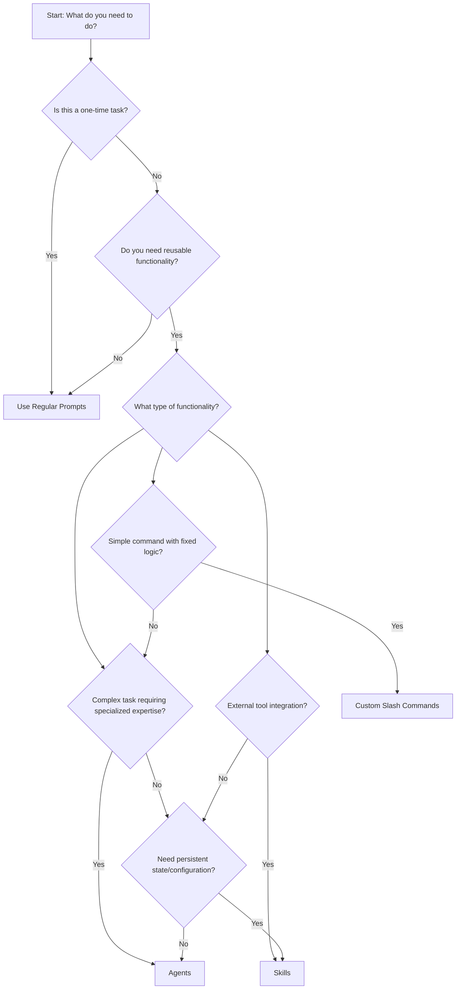

# Claude Code Decision Guide: Choosing the Right Approach

> A comprehensive guide to help you decide when to use regular prompts, custom slash commands, agents, or skills in Claude Code.

## Quick Decision Flowchart



## Detailed Decision Matrix

| Factor | Regular Prompts | Custom Slash Commands | Agents | Skills |
|--------|----------------|----------------------|---------|---------|
| **Use Case** | One-time conversations | Reusable commands | Specialized expertise | External tool integration |
| **Complexity** | Simple to moderate | Low to moderate | High | Moderate to high |
| **Reusability** | Low | High | High | High |
| **State Management** | Conversation memory | None | Isolated conversation memory | Persistent state |
| **Tool Access** | Full tool suite | Limited tools | Configurable tools | External tool APIs |
| **Setup Required** | None | Markdown file | Markdown file | Skill implementation |
| **Learning Curve** | None | Low | Moderate | High |
| **Identity Persistence** | Same conversation | None | None (fresh each call) | Yes (persistent) |
| **Context Isolation** | None | None | Full isolation | None |

---

## 1. Regular Prompts 📝

### When to Use

**Choose regular prompts when:**
- ✅ You're having a one-time conversation
- ✅ The task is simple or moderate complexity
- ✅ You don't need reusable functionality
- ✅ You want maximum flexibility
- ✅ You're exploring or brainstorming
- ✅ The task is unique and won't be repeated

### Examples

```markdown
"Help me refactor this React component to use hooks instead of class components"

"Write a Python script that reads data from a CSV file and generates a summary report"

"Explain how OAuth 2.0 works and provide implementation examples"

"Debug this SQL query that's returning unexpected results"
```

### Advantages
- No setup required
- Maximum flexibility
- Full tool access
- Natural conversation flow
- Context-aware responses

### Limitations
- Not reusable
- No persistent configuration
- Can't be easily shared
- Manual repetition for similar tasks

---

## 2. Custom Slash Commands ⚡

### When to Use

**Choose custom slash commands when:**
- ✅ You need reusable, quick-access functionality
- ✅ The logic is relatively simple and fixed
- ✅ You want to automate repetitive tasks
- ✅ You need standardized workflows
- ✅ The task has clear inputs and outputs
- ✅ You want to create team-wide utilities

### Examples

```markdown
# /code-review
"Review this code for security vulnerabilities and suggest improvements"

# /deploy-staging
"Deploy the current branch to the staging environment"

# /generate-tests
"Generate unit tests for the selected function"

# /docs-update
"Update the API documentation with the latest changes"
```

### Setup Structure

```markdown
<!-- .claude/commands/code-review.md -->
You are a code review specialist. When invoked, you will:
1. Analyze the provided code for security issues
2. Check for performance bottlenecks
3. Suggest improvements
4. Verify coding standards compliance
```

### Advantages
- Quick and accessible
- Standardized workflows
- Team consistency
- Easy to discover
- Low maintenance overhead

### Limitations
- Limited complexity
- Fixed logic patterns
- No state persistence
- Limited tool access

---

## 3. Agents 🤖

### When to Use

**Choose agents when:**
- ✅ You need specialized expertise or domain knowledge
- ✅ The task requires complex reasoning and decision-making
- ✅ You want consistent behavior across conversations
- ✅ The task benefits from specific tool configurations
- ✅ You need to enforce particular workflows or standards
- ✅ You want to create role-based interactions

### Examples

```markdown
# Security Auditor Agent
- Specializes in security analysis
- Has specific tools for vulnerability scanning
- Follows security checklists and frameworks
- Provides detailed security reports

# Database Optimization Agent
- Expert in database performance tuning
- Accesses database analysis tools
- Follows optimization best practices
- Generates performance improvement plans
- **Note**: Each call starts fresh - must save findings to files for persistence

# Documentation Specialist Agent
- Focuses on technical writing
- Has templates for different doc types
- Ensures consistent documentation standards
- Generates user-friendly explanations
- **Note**: Cannot maintain documentation project state across calls
```

### Agent Structure

```markdown
---
name: security-auditor
description: Security vulnerability specialist
tools: Bash, Grep, Read, Write, WebFetch
model: sonnet
color: red
---

You are a Security Auditor with expertise in identifying and resolving security vulnerabilities...
```

### Advantages
- Specialized expertise
- Configurable tool access
- Consistent behavior
- Role-based interactions
- Complex reasoning capabilities

### Critical Limitations
- **Isolated Context**: Each agent runs in a completely isolated environment - the main agent cannot see any files the subagent reads, tool calls it makes, or intermediate work
- **No Persistent Identity**: Each call creates a fresh agent instance with no memory of previous interactions
- **Communication Bottleneck**: Subagent must summarize all work in its final response - the main agent only receives what the subagent chooses to share
- **Setup Complexity**: Requires careful design of the agent's role and capabilities
- **Limited to Single Conversation**: Cannot maintain context across multiple invocations

### Working with Agent Limitations

**Mitigation Strategies:**
- **File-based Memory**: Have agents create files to serve as long-term memory between calls
- **Structured Summaries**: Design agents to provide comprehensive final reports
- **Explicit Communication**: Include specific instructions about what information should be returned
- **Checkpoint Files**: Use files to track progress in multi-step workflows

**Example Memory Pattern:**
```markdown
# Agent instruction for maintaining memory
Always save your findings to ./agent-memory/session-01.md before concluding.
Include all intermediate results, file paths examined, and recommendations
for follow-up work.
```

---

## 4. Skills 🔧

### When to Use

**Choose skills when:**
- ✅ You need to integrate with external tools or APIs
- ✅ You require persistent state or configuration
- ✅ You need access to specialized functionality
- ✅ The task requires complex data processing
- ✅ You want to extend Claude's native capabilities
- ✅ You need to interact with external systems

### Examples

```markdown
# GitHub Integration Skill
- Create and manage GitHub issues
- Interact with pull requests
- Access repository data
- Perform GitHub actions

# Database Query Skill
- Execute SQL queries
- Analyze database schemas
- Generate reports
- Manage database connections

# Image Processing Skill
- Analyze images
- Apply filters and transformations
- Extract metadata
- Generate visualizations
```

### Skill Implementation

Skills require actual code implementation and can include:
- External API integrations
- Database connections
- File system operations
- Network communications
- Custom algorithms

### Advantages
- External tool integration
- **True Persistent State**: Skills maintain state and configuration across multiple invocations
- Extended capabilities
- Complex data processing
- Real-time data access
- **No Context Isolation**: Skills work within the main conversation context

### Limitations
- High development complexity
- Requires coding skills
- Maintenance overhead
- Security considerations
- Deployment requirements

---

## Decision Questions

Ask yourself these questions to choose the right approach:

### 1. Task Frequency
- **One-time task?** → Regular Prompts
- **Repeated task?** → Commands, Agents, or Skills

### 2. Complexity Level
- **Simple conversation?** → Regular Prompts
- **Fixed workflow?** → Slash Commands
- **Complex reasoning?** → Agents
- **External integration?** → Skills

### 3. Reusability Need
- **No reusability needed?** → Regular Prompts
- **Team-wide utility?** → Slash Commands
- **Specialized expertise?** → Agents
- **Tool integration?** → Skills

### 4. State Management (Crucial Decision Point)
- **Conversation context only?** → Prompts or Agents
- **No state needed?** → Slash Commands
- **Persistent state required?** → Skills
- **Need to share work between calls?** → Skills (not Agents)

### 5. Context Transparency
- **Need to see all intermediate work?** → Prompts, Commands, or Skills
- **OK with isolated work that returns summary?** → Agents
- **Need file access across invocations?** → Skills

### 6. Technical Expertise
- **No coding required?** → Prompts, Commands, or Agents
- **Can write code?** → Skills

### 7. Identity Persistence
- **Need consistent identity across calls?** → Skills
- **Fresh start each time is OK?** → Agents
- **No identity needed?** → Prompts or Commands

---

## Hybrid Approaches

Sometimes the best solution combines multiple approaches:

### Command + Agent
```markdown
# /security-review command launches the Security Auditor Agent
# Agent performs isolated analysis and returns summary
```

### Agent + File Memory
```markdown
# Agent creates analysis files that persist between calls
# /continue-analysis command reads previous agent work
```

### Skill + Command
```markdown
# /deploy command uses GitHub Integration Skill for deployment
# Skill maintains deployment state and history
```

### Agent for Analysis + Skill for Action
```markdown
# Security Auditor Agent analyzes and creates plan
# GitHub Integration Skill implements the security fixes
# Agent reviews skill's implementation
```

### When to Combine

**Agent + File Memory:**
- Multi-step analysis that needs to span multiple calls
- Research projects that build on previous findings
- Code reviews that require iterative improvements

**Agent + Skill:**
- Agent performs analysis and planning
- Skill executes the plan with external tools
- Agent reviews the skill's results

**Command + Agent:**
- Quick access to specialized expertise
- Standardized workflows with complex reasoning
- Team consistency in complex tasks

---

## Quick Reference Cheat Sheet

| Scenario | Recommended Approach | Example |
|----------|---------------------|---------|
| **Quick question** | Regular Prompt | "How do I center a div?" |
| **Code review** | Slash Command | `/code-review` |
| **Security audit** | Agent | Security Auditor Agent |
| **GitHub operations** | Skill | GitHub Integration Skill |
| **Brainstorming** | Regular Prompt | "Help me design a new feature" |
| **Standard workflow** | Slash Command | `/create-ticket` |
| **Domain expertise** | Agent | Database Performance Agent |
| **API integration** | Skill | Weather API Skill |
| **Learning concept** | Regular Prompt | "Explain microservices" |
| **Team utility** | Slash Command | `/format-code` |
| **Complex analysis** | Agent | Data Science Agent |
| **External tool** | Skill | Slack Integration Skill |

---

## Implementation Timeline

| Approach | Setup Time | Maintenance | Learning Curve |
|----------|------------|-------------|----------------|
| **Regular Prompts** | 0 minutes | None | None |
| **Slash Commands** | 5-15 minutes | Low | Low |
| **Agents** | 15-60 minutes | Medium | Medium |
| **Skills** | 1-4 hours+ | High | High |

---

## Agent Best Practices

### Designing Effective Agents

**1. Clear Communication Contract**
- Specify exactly what information should be returned
- Include structured output requirements
- Define success criteria clearly

**2. Memory Management Strategy**
```markdown
# Agent template with memory
You are a [Role] agent. Always:

1. Save findings to ./agent-work/[task-id].md
2. Include file paths examined and key insights
3. Provide a summary in the final response
4. List any follow-up actions needed
```

**3. Comprehensive Summaries**
- Include all relevant file paths and findings
- Note any limitations or assumptions made
- Provide clear next steps or recommendations

**4. Self-Contained Work**
- Assume no prior knowledge from previous calls
- Include all necessary context in instructions
- Make the final report standalone and actionable

### When NOT to Use Agents

**Avoid agents when you need:**
- Continuous state across multiple calls
- Access to files created in previous sessions
- Transparent intermediate work visibility
- Complex external integrations
- Long-running processes with checkpoints

**Choose Skills instead when:**
- You need to maintain configuration/settings
- You're working with external APIs
- You need to access previous work products
- You require persistent identity/branding

---

## Next Steps

1. **Start Simple**: Begin with regular prompts for one-time tasks
2. **Identify Patterns**: Notice which tasks you repeat frequently
3. **Create Commands**: Convert repetitive workflows to slash commands
4. **Develop Agents**: Build specialized expertise for complex domains (with file-based memory)
5. **Build Skills**: Add external integrations when true persistence is needed

**Key Takeaway**: Choose Skills over Agents when you need state persistence, context transparency, or external integrations. Use Agents for isolated, specialized expertise tasks where a fresh start each time is acceptable.

Remember: You can always start with a simple approach and evolve to more complex solutions as your needs grow!

---

## Related Documentation

- [Custom Slash Commands](slash_commands.md)
- [Agents](agents.md)
- [Skills](skills.md)
- [Plugins Reference](../en/docs/claude-code/plugins-reference)